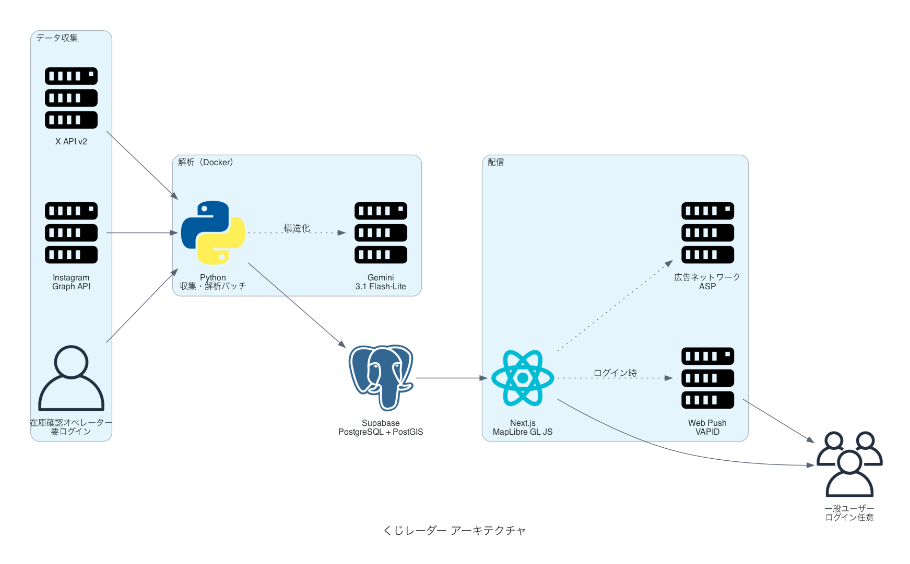

# くじレーダー（ichiban-radar）

**SNS投稿をAIが解析し、一番くじの在庫ステータスを地図上に可視化するWebサービス。**

お目当てのくじを求めて何軒もハシゴする徒労と、「在庫ありますか？」という電話に追われる店舗の負担。その両方を、SNSに流れている情報を構造化することで解消します。

> 着想は金融の**オルタナティブデータ分析**（SNSテキストから市場の動きを推測する手法）にあります。「バラバラのテキストから現実の数値を推測する」という構造を、そのまま在庫推測に応用しています。

---

## 現在のステータス

🚧 **開発初期。X API / Instagram Graph API の承認待ちのため、データはすべてモックです。**

| 領域 | 状態 |
| :--- | :--- |
| 企画・技術仕様・事業計画 | ✅ [docs/](docs/) に一式 |
| Webアプリ（マップ・店舗詳細・A賞フィルタ） | ✅ 動作（モックデータ） |
| 一般ユーザーのログイン・お気に入り | ✅ 動作（ログインは任意） |
| プッシュ通知（Web Push） | ✅ 実装済み（VAPIDキー設定で有効化） |
| 在庫確認コンソール（管理画面） | ✅ 動作（**登録・ログインあり**） |
| プレミアムプランの決済 | ❌ 未実装 |
| Gemini 解析バッチ | ✅ 実装済み・**未実行**（APIキー取得待ち） |
| 実測スクリプト（X / Instagram / Gemini） | ✅ 実装済み・**未実行**（APIキー取得待ち） |
| X API 連携 | ⏳ 開発者アカウント承認待ち |
| Instagram 連携 | ⏳ App Review 承認待ち |
| Supabase（PostGIS） | ❌ 未実装 |
| 広告・アフィリエイト | ❌ 未着手（[実装ガイド](docs/8_広告・アフィリエイト実装ガイド.md)） |

**最優先の未確定事項は「SNS投稿から店舗を特定できる割合」**です。この数値がサービスの成立可否そのものを決めるため、事業計画の数字はすべてこれが出るまで暫定値です。測り方は [docs/5](docs/5_APIキー取得手順と実測手順.md) にあります。

次に何をやるかは [TODO.md](TODO.md) にまとめています。

---

## サービスの形

| | 内容 |
| :--- | :--- |
| **一般ユーザー（未ログイン）** | 地図・店舗詳細・「A賞あり」フィルタを**登録なしで**使える |
| **一般ユーザー（プレミアム）** | 上記に加えて、**お気に入り店舗の登録**と**在庫急変のプッシュ通知**。月額390円 |
| **オペレーター** | 在庫確認コンソール（要ログイン）から、電話確認した残り本数とA賞の有無を入力する |
| **収益** | 広告・プレミアムプラン・B2B（店舗掲載枠）の3本 |

**無料機能を人質に取らない**設計です。地図を見たいだけの人は登録せずに使えるので離脱せず、課金するのは特定の店を張っている層だけになります。

在庫判定は**単一の投稿を鵜呑みにしません**。複数投稿のクロス検証と鮮度減衰を通し、確信度の低い情報は表示しません。判定の根拠になった投稿は必ず開示します。

### 立ち上げ期は、電話確認が品質を担保する

予備調査（[docs/4 §0-2](docs/4_一番くじ在庫マップ_データ収集実現可能性調査.md)）で、**一般ユーザーの投稿からは店舗をほぼ特定できない**ことが分かりました。残数は書いても店名は書かないためです。店舗が特定できるのは、店舗アカウント自身の投稿にほぼ限られます。

つまり**公開初期は、SNSだけでは地図が埋まりません。** この期間の品質は、**オペレーターの電話確認（確定情報）が担保します。**

利用者が増えれば投稿量そのものが増え、店舗側も告知の効果を実感して発信を増やすため、**SNSの比重は時間とともに上がる**見込みです。電話確認は恒久的な主力ではなく、**その立ち上がりまでの橋渡し**という位置づけです。

> ⚠️ この見立ては n=24 の予備調査に基づく仮説です。**確定値ではありません。** 正式な数字はX APIでの実測（[docs/5](docs/5_APIキー取得手順と実測手順.md)）で確定させます。

---

## アーキテクチャ

図は技術スタックを示すものです。実装の進捗は上の「現在のステータス」表を参照してください。

UIはSNSのAPIを直接呼ばず、**常に「解析済みの結果」だけを見ます**。この分離により、収集基盤が完成する前にフロントを作り切れます。いまは `MockDataSource` が刺さっており、承認が下りたら `SupabaseDataSource` に差し替えるだけで**UI側は一行も変わりません**。

---

## ドキュメント

| # | 文書 | 内容 |
| :-- | :--- | :--- |
| 1 | [企画書](docs/1_一番くじ在庫マップ_企画書.md) | 全体像・課題・ステータス定義・フェーズ計画 |
| 2 | [技術仕様書](docs/2_一番くじ在庫マップ_技術仕様書.md) | 技術スタック・クエリ設計・DBスキーマ |
| 3 | [事業・資金計画書](docs/3_一番くじ在庫マップ_事業・資金計画書.md) | 予算・認定員制度・運用設計 |
| 4 | [データ収集実現可能性調査](docs/4_一番くじ在庫マップ_データ収集実現可能性調査.md) | X API / Instagram の制約とコスト試算 |
| 5 | [APIキー取得手順と実測手順](docs/5_APIキー取得手順と実測手順.md) | 各APIの取得方法・スクリプトの使い方 |
| 6 | [収益計画書](docs/6_一番くじ在庫マップ_収益計画書.md) | 広告・プレミアム・B2B・損益分岐点・回収期間 |
| 7 | [クラウドファンディング本文ドラフト](docs/7_クラウドファンディング本文ドラフト.md) | 支援募集ページの原稿 |
| 8 | [広告・アフィリエイト実装ガイド](docs/8_広告・アフィリエイト実装ガイド.md) | ASP選定・提携手順・ステマ規制対応 |
| 9 | [デプロイ手順書](docs/9_デプロイ手順書.md) | Cloud Run / Neon への公開手順・費用・チェックリスト |

---

## 開発する

セットアップ、リポジトリ構成、実行方法、**壊してはいけない不変条件**は [CONTRIBUTING.md](CONTRIBUTING.md) にまとめています。

---

## 注意事項

- 本サービスは**非公式**であり、株式会社BANDAI SPIRITS様をはじめとする各権利者様とは一切関係ありません
- 「一番くじ」は株式会社BANDAI SPIRITS様の登録商標です
- データ取得は**公式API（X API / Instagram Graph API）のみ**を使用し、規約に反するスクレイピングは行いません
- 表示する在庫情報は**推測**であり、実際の在庫を保証するものではありません
